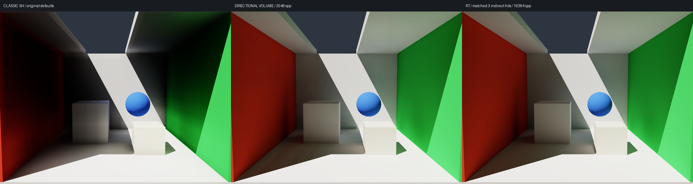

# Error diagnosis and the 5% acceptance gate

> The current default has been corrected to an RT-guided compact SH9 field. This page preserves the earlier kernel's history; see [SH_RADIANCE.md](SH_RADIANCE.md) for the latest analysis and low-error acceptance results.

> The default was subsequently upgraded to GV + 26 neighbors + temporal refinement. This page records the preceding kernel / preset; see [SH_REFINEMENT.md](SH_REFINEMENT.md) for that evaluation.

> 2026-10-05 update: the passing results and directional-map consumption described here apply to `--transport directional`. The default at that stage became compact SH LPV; see [COMPACT_LPV.md](COMPACT_LPV.md) for its memory, performance, and substantial quality regression. The accumulated angular cache in directional mode is now allocated on demand.

2026-10-04, Metal / local SlangPy 0.43.0. Numerical comparisons use unexposed linear RGB with a fixed scene, camera, lighting, and depth of three indirect material reflections.

## Fixed metric

The metric from earlier reports is retained:

\[
\mathrm{NRMSE}=\frac{\sqrt{\operatorname{mean}((L_{\mathrm{LPV}}-L_{\mathrm{RT}})^2)}}
 {\operatorname{mean}(L_{\mathrm{RT}})}.
\]

It is evaluated over the complete RGB image, including the background, without cropping, exposure changes, or refitting indirect-light intensity.
This is normalized RMSE of total lighting, not a guarantee of at most 5% error in each pixel or relative error of indirect lighting alone.
The independent RT reference traces material paths directly without reading the LPV field. Both algorithms include three indirect surface hits and use identical materials, geometry, and cameras.

`./run_local.sh --accuracy --transport directional --extra-cases` reproduces the directional-mode default view, side view, and changed-sun acceptance cases. Any result above 5% returns nonzero.
LPV uses 2048 spp and RT 16384 spp. These converge pixel sampling only; the volume field is not fitted to the reference image.
The report also estimates reference sampling noise by comparing the complete average with the first-half average, equivalent to estimating the full-average variance from the difference between two independent half-sample sets.

## Why parameter tuning could not fix the original implementation

An initial 160×120, 1024 spp screening of the original SH9 propagation kernel produced:

| Grid / spatial steps / decay | NRMSE |
| --- | ---: |
| 8³ / 24 / 0.95 | 19.93% |
| 16³ / 24 / 0.95 | 29.92% |
| 16³ / 32 / 0.95 | 30.06% |
| 16³ / 32 / 1.0 | 41.44% |
| 32³ / 32 / 0.95 | 55.00% |
| 32³ / 32 / 1.0 | 95.70% |
| 64³ / 32 / 1.0 | 40.60% |

These are diagnostic results for systematic error that parameter tuning cannot resolve, not final high-quality acceptance runs of different algorithms.
A finer grid shortens propagation range; fixed per-step decay also changes attenuation over the same world-space distance.
The original implementation was simultaneously too bright in directly lit areas and too dark in shadow, so one global intensity adjustment could not correct it.

A more direct check computes the kernel's SH linear transform in a spatially uniform angular field without geometry.
For small directional perturbations that do not trigger negative-value clamping, the original kernel's angular-mode gains are:

| Mode | Per-step gain |
| --- | ---: |
| L0 | 1 |
| Three L1 components | 0.36864318 |
| Five L2 components | 0, 0, 0.01847926, 0, 0.01847926 |

These use the main/side-face solid angles in the code, also listed in [Kirsch's LPV annotations](https://data.blog.blackhc.net/2010/07/lpv-annotations.pdf).
The matrix above was computed for this project's kernel. Spatially uniform but directionally nonuniform radiance should remain unchanged under free transport in vacuum.
The original kernel reprojects a cosine lobe at every air cell, substantially losing directional information. Negative SH clamping, repeated spatial diffusion, coarse geometry coverage, and interpolation without visibility filtering add further bias.
It is a strong traditional-LPV approximation; using nine SH coefficients per color does not imply accurate directional propagation.

## Passing path: direction-preserving volume transport

At this stage, the default became a directionally discretized LPV extension, retaining the classic SH kernel for comparison. This explicitly changes the angular representation and propagation operator.
Final shading also cosine-integrates angular samples. SH9 is used only for slices and field export, not as the high-accuracy consumption representation.

1. A fixed integer direction lattice defines a symmetric angular set. Cache RT segment queries from each cell to its upstream cell.
   Hits cache surface normal, distance, and material index; out-of-bounds values are empty. Weights are spherical Voronoi solid angles of the direction lattice, independent of the scene and reference images.
2. The first order uses full RT rays from probes to evaluate `Le + rho*E_direct/pi` at actual surfaces.
   Averaging 8 subsamples per direction bin directly solves the complete first-order field. Later orders use local boundary conditions `rho*E_previous/pi`.
   Lambertian outgoing radiance has no extra `cos(outgoing)` factor; coverage and angular integration account for geometry.
3. Air cells without hits copy radiance only from the upstream cell in the same direction, preserving direction rather than creating new cosine lobes.
   Without a participating medium, decay defaults to 1. Radiance does not attenuate with distance along a ray; shrinking solid-angle coverage of distant surfaces naturally accounts for geometric falloff.
4. Solve a complete spatial field independently for each material order, then sum each order exactly once. Spatial iterations solve boundary-condition propagation; they do not accumulate successive steady-state estimates.
5. Final consumption and surface-reflection queries use visibility-filtered eight-neighbor interpolation, rejecting cells across walls or behind solid surfaces and renormalizing the remaining weights.
   Angular cosine integration is normalized to π, giving `E=pi*L` for uniform radiance at any normal.

The path still uses a static grid, injection, propagation, material reflection, and volume consumption. Camera rays perform only visibility / direct-light queries; LPV mode does not trace random multi-reflection paths.
The RT reference uses a separate per-pixel path integrator, so quality comparisons do not share its indirect-light results.

Defaults are 32³, 1154 directions, 40 spatial steps per material order after the first order, and three material orders. The integer direction-lattice extent is 5.
`--angular-resolution 1..5` selects 26 / 98 / 290 / 578 / 1154 directions. Reducing it exposes bands caused by angular discretization.
`--steps` should at least cover free propagation in the grid's slowest direction. The default 40 covers 32³; when increasing the grid, use `grid+2` or more.
Angular representation has a substantial memory cost: the main angular cache at 32³ / 1154 directions occupies about 3.8 GB, excluding runtime / images.
Classic SH mode remains available with less memory:

```bash
./run_local.sh --transport sh --grid 16 --steps 24 --decay .95 --read-bias .25
./run_local.sh --transport directional --angular-resolution 3
./run_local.sh --accuracy --transport directional --extra-cases
```

## Validation

24 CPU/GPU checks cover the old and new paths. New checks confirm:

- Angular weights are positive and sum to 4π; directions are unit length and antipodally symmetric.
- A spatially uniform but angularly nonuniform field is preserved direction by direction in air.
- A single diffuse plane produces no false self-lighting or self-bounce.
- Synthetic closed radiance boundaries yield `1+rho+rho²`; more spatial iterations do not repeatedly accumulate history.
- Camera and material-reflection-depth changes reuse geometry / direct-light caches; switching transport modes back gives deterministic results; lights off leaves no residual.

High-quality numerical results and images are generated by `scripts/validate_accuracy.py`; see `accuracy-report.json` and `accuracy-comparison.png` in this directory. The old report is retained as `accuracy-report-before-footprints.json`.
Finite angular resolution, spatial interpolation, thin geometry, smooth normals, and finite material depth still introduce errors. Passing these three cases does not prove the same 5% bound for arbitrary scenes or infinite reflections.

## Results before angular-footprint sampling

| Case | NRMSE | RT noise estimate |
| --- | ---: | ---: |
| Default camera / sun | 2.76% | 0.56% |
| Side view | 3.86% | 0.72% |
| Sun at azimuth=-35° / elevation=40° | 2.35% | 0.48% |

The original default SH configuration gives 30.03%. All three new cases use the same propagation settings; exposure and indirect intensity are not fitted.
The earlier 578-direction version gave 3.54% / 5.06% / 2.91% under the same high-sample metric, motivating a uniform increase to 1154 directions.
More pixel samples reduce only reference / antialiasing noise; angular refinement genuinely reduces the remaining discretization error.



## After the wall-patch fix, before distance moments

First-order radiance is solved directly with full probe RT and 8 angular-footprint subsamples. Later material orders still use direction-preserving grid propagation.
`--steps` now constrains only directional propagation after the first order. Final interpolation, exposure, grid, direction count, material depth, read bias, and indirect intensity remain unchanged.
This removes some brightness discontinuities from fixed directional coverage. See [WALL_ARTIFACTS.md](WALL_ARTIFACTS.md) for the decomposition, costs, and wall-specific metrics.

| Case | NRMSE at this stage | RT noise estimate |
| --- | ---: | ---: |
| Default camera / sun | 1.79% | 0.56% |
| Side view | 2.30% | 0.72% |
| Changed sun direction | 1.73% | 0.48% |

The machine-readable report for this stage is retained as [accuracy-report-before-moments.json](accuracy-report-before-moments.json), and the three-case image as [accuracy-cases-before-moments.png](accuracy-cases-before-moments.png).
Earlier reports / comparisons retain the `-before-footprints` suffix. All 24 CPU/GPU checks pass.

## Default at this stage: distance-moment visibility and cached irradiance

2026-10-05: final consumption and secondary reflections switch to distance-moment / Chebyshev weights plus precomputed cosine-integrated irradiance direction maps.
Directional transport and the 8-sample first flight remain unchanged. NRMSE for the three fixed cases is **2.54% / 3.30% / 2.15%**, all below 5%.
This adds approximation error relative to exact-ray consumption at **1.79% / 2.30% / 1.73%**, while largely retaining the fixed walls' low-frequency smoothness.
Steady consumption drops from 9.06 ms to 0.62 ms; updates including secondary reflections and propagation drop from 2.37 s to 1.46 s.
See [PROBE_VISIBILITY.md](PROBE_VISIBILITY.md) for performance, thin-wall tests, query offsets, and approximately 0.53 GB of additional caches.
29 CPU/GPU checks and three-frame window presentation pass. The report is [accuracy-report.json](accuracy-report.json).
