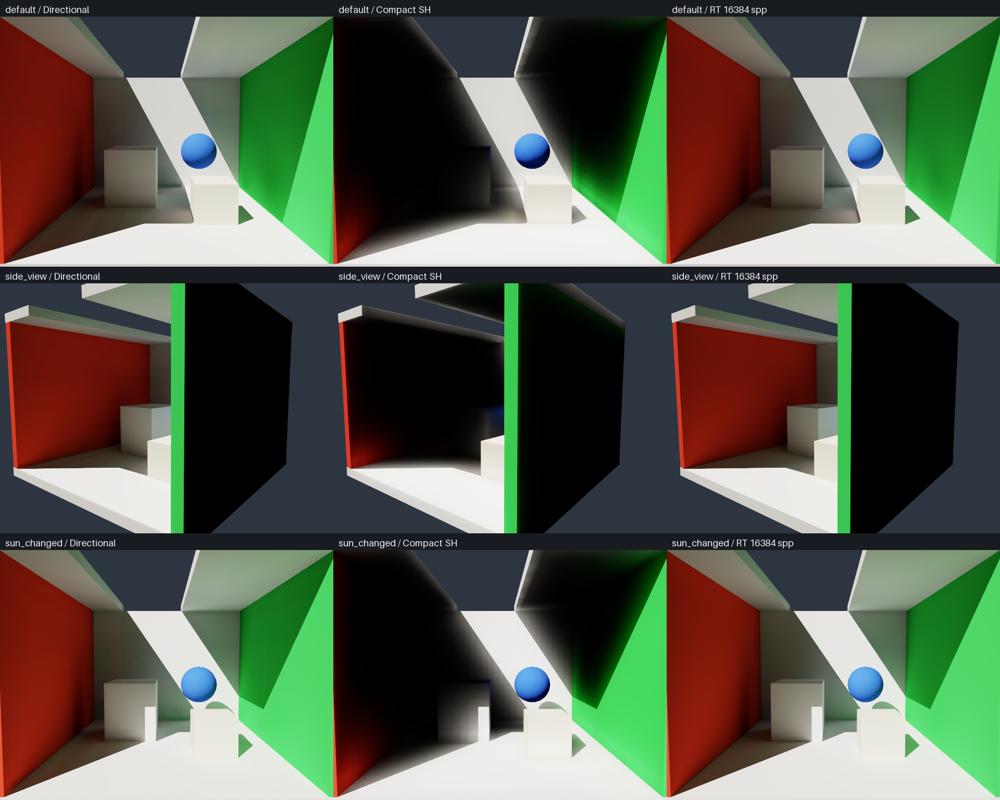

# Compact SH LPV: structure and quality tradeoffs

> The current default has been corrected to an RT-guided compact SH9 field. This page preserves the earlier kernel's history; see [SH_RADIANCE.md](SH_RADIANCE.md) for the latest analysis and low-error acceptance results.

> The default was subsequently upgraded to GV + 26 neighbors + temporal refinement. This page records the preceding kernel / preset; see [SH_REFINEMENT.md](SH_REFINEMENT.md) for that evaluation.

2026-10-05, Metal / SlangPy 0.43.0. This iteration restored an SH9 core as the default instead of the discrete-direction extension. The quality loss is not presented as an equivalent optimization.

## Default path at this stage

Defaults: 32³, 40 spatial steps, three indirect material orders, `--transport sh --probe-visibility moments`.

1. Area-weighted surface samples provide normals, albedo, and emission; RT tests sunlight occlusion.
   Inject `Phi = (rho*E_direct + pi*Le)*area`, projecting the cosine lobe of `Phi/(pi*h²)` into RGB×9 SH.
2. During static geometry preparation, five short rays per six-neighbor link cache coverage, albedo, and the reflection SH response facing the source side.
   These build geometry caches; they are not the eight-probe visibility rays at every screen sample.
3. Propagation uses six neighbors / five-face angular integration and stores the current front by material order. Only blocked outgoing flux from the previous order enters the next reflection order.
   Accumulated lighting is not fed back into reflection, and additional spatial steps do not create unlimited material orders.
4. Final shading blends eight neighboring SH probes using octahedral distance moments and Chebyshev weights, then applies SH cosine convolution for irradiance.
   Neither 1154-direction radiance nor 17×17 irradiance maps are needed.

SH restores the original per-step `decay=.95` damping. This is an engineering preset for low-order propagation: it loses energy and must not be treated as vacuum transport.
Directional mode still defaults to `decay=1`. `--decay` overrides either default, and explicit user values are retained when switching modes.

## Outgoing flux budget

Clamping negative SH reconstruction can make the integral of positive queries exceed the original zeroth-order integral. For each source cell and color channel,
we now sum the same six-face quadrature used by propagation / reflection and impose a budget:

\[
B=\max(\sqrt{4\pi}\,c_0,0),\qquad
Q=\sum_{i=0}^{5}\phi_i(C),\qquad
s=\min\left(1,\frac{B}{\max(Q,\epsilon)}\right).
\]

Transmission and reflection queries share `s*C`; SHCell itself is not modified in place. This limits energy generated by the discrete stencil.
It does not fix directional diffusion, prove physical correctness, or fit a brightness multiplier to the reference.
Actual GPU checks cover homogeneous fields, closed reflection series, partial-occlusion budgets, and multi-step budgets with strong SH ringing.

## Memory

`renderer.volume_memory()` reads `.size` from allocated buffers, including retained distance-ray scratch.
It excludes scene/TLAS data, images, CPU arrays, program caches, and runtime memory. It is neither process RSS nor measured resident GPU memory.

| Default SH buffer at this stage | Size (decimal MB) |
| --- | ---: |
| source + accumulated | 7.34 |
| front + next for three material orders | 22.02 |
| Six-face reflection SH cache | 22.02 |
| Links, surface samples, bins | 8.78 |
| Distance-moment maps | 84.93 |
| Distance-ray scratch | 67.11 |
| Active flags, directions, filter tables | 0.31 |
| **Total** | **212.51** |

FP32 is retained to check numerical behavior and operators. Most savings come from removing the per-direction representation. Distance moments and scratch now dominate;
converting SH alone to half precision would not yield another reduction by tens of times.

The directional comparison also received an independent, lossless memory reduction: moments consumption no longer allocates a complete accumulated angular array, binding only a 16-byte placeholder.
Unused classic-SH front/reflection/link buffers are also omitted. The default directional comparison now occupies **3.716 GB**.
The previous layout implies approximately **4.366 GB**. Relative to that version, the new default SH GI payload is about **20.54 times** smaller;
relative to the reduced directional mode, it is about **17.49 times** smaller.

`--probe-visibility ray/none` requires the directional array for on-demand integration and allocates the full `total` as needed.
Python's `renderer.angular_data('total')` explicitly enables accumulated-direction diagnostics and rebuilds the field; the diagnostic array is then retained.
Switching from directional mode to SH releases the directional object. Switching from SH to directional mode releases SH-specific resources and the distance-moment object.
Grid changes reuse cache objects and rebuild their resources. Camera or lighting changes do not rebuild distance moments.

## UE4.27 comparison

The following were checked through signed-in Safari:

- [LPVCommon.ush](https://github.com/EpicGames/UnrealEngine/blob/4.27/Engine/Shaders/Private/LPVCommon.ush) tightly packs RGB×9 coefficients and AO into seven RGBA volume textures.
- [LightPropagationVolume.cpp](https://github.com/EpicGames/UnrealEngine/blob/4.27/Engine/Source/Runtime/Renderer/Private/LightPropagationVolume.cpp) uses 32³, `PF_FloatRGBA` (RGBA16F), and two alternating buffer sets.
  The theoretical main lighting-volume payload is `32³*7*8*2=3.5 MiB`, not the total memory of the LPV system.
  Additional resources include the geometry volume, AO, VPL linked lists, and RSMs.

This project uses the same low-order angular-representation idea, but retains FP32 buffers, explicit material orders, and a six-neighbor stencil.
UE's 26-neighbor stencil, geometry-volume packing, and temporal refinement differ; this is not claimed to be a component-by-component UE4 replica.

## Performance and accuracy

Performance: 640×480 / 1 spp, after compilation and warmup, CPU wall clock + `device.wait()`, including rendering / accumulation / tone mapping
but excluding UI/presentation. Updates alternate between 40/41 spatial steps, retaining geometry, distance moments, and direct-source caches. Each mode uses its decay preset described above.

| Mode | Steady rendering | Propagation update | GI buffers |
| --- | ---: | ---: | ---: |
| Directional, moments | 0.619 ms | 1409.61 ms | 3716.47 MB |
| **Compact SH, moments** | **0.613 ms** | **13.86 ms** | **212.51 MB** |

Propagation updates are about 101.68 times faster. Both modes already have inexpensive irradiance queries for final consumption, so rendering times are similar.
Report: [compact-volume-benchmark.json](compact-volume-benchmark.json).

Quality uses the same full 640×480 linear-RGB images, LPV 2048 spp / RT 16384 spp, and three indirect material orders:

| Case | Directional | Compact SH default |
| --- | ---: | ---: |
| Default view | 2.54% | **49.75%** |
| Side view | 3.30% | **74.67%** |
| Changed sun direction | 2.15% | **41.31%** |

**The SH default fails the 5% gate.** Directional diffusion, lighting concentrated near local sources, coarse surface positions, and approximate geometry coverage still produce large spatial biases.
The new flux budget addresses only stencil energy gain; it does not turn low-order reprojection into direction-preserving transport.
Similar mean brightness does not imply similar image quality. Indirect-light strength and exposure were not adjusted, and images were not cropped.
After redundant directional caches were removed, all three RGB arrays remained bit-identical to the previous version; its quality did not degrade from this memory optimization.



See [compact-lpv-accuracy.json](compact-lpv-accuracy.json) and the directional comparison [directional-compact-cache-accuracy.json](directional-compact-cache-accuracy.json).
`--accuracy` retains the 5% threshold and returns nonzero when SH fails it; that exit code must not be confused with a GPU regression-test failure.

```bash
./run_local.sh
./run_local.sh --transport directional
./run_local.sh --benchmark-volume
./run_local.sh --accuracy --extra-cases
./run_local.sh --accuracy --transport directional --extra-cases
```

34 CPU/Metal debug GPU checks cover material reflections, energy constraints, optional directional arrays, resource switching, SH distance-moment thin-wall tests,
distance-map seams / caching, existing directional transport, and emissive injection. Passing these tests is not equivalent to passing the 5% image-quality gate.
