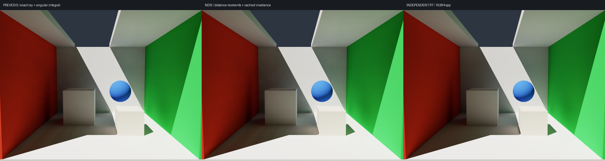

# Distance moments and Chebyshev probe visibility

> The current default has been corrected to an RT-guided compact SH9 field. This page preserves the earlier kernel's history; see [SH_RADIANCE.md](SH_RADIANCE.md) for the latest analysis and low-error acceptance results.

> The default was subsequently upgraded to GV + 26 neighbors + temporal refinement. This page records the preceding kernel / preset; see [SH_REFINEMENT.md](SH_REFINEMENT.md) for that evaluation.

> 2026-10-05 update: the passing results and directional-map consumption described here apply to `--transport directional`. The default at that stage became compact SH LPV; see [COMPACT_LPV.md](COMPACT_LPV.md) for its memory, performance, and substantial quality regression. The accumulated angular cache in directional mode is now allocated on demand.

2026-10-05. This implementation references the following local sources in `Downloads/RTXGI-DDGI-main/rtxgi-sdk`:

- `shaders/ddgi/ProbeBlendingCS.hlsl`: angular filtering of distance and squared distance, `cos^probeDistanceExponent`, and local distance limits.
- `shaders/ddgi/Irradiance.hlsl`: Chebyshev weights, cubing to suppress light leaks, wrap-normal weights, low-weight compression, and eight-probe normalization.
- `shaders/ddgi/include/ProbeOctahedral.hlsl`: octahedral encoding of spherical directions.
- `shaders/ddgi/ProbeClassificationCS.hlsl`: excluding probes inside solids using the backface-hit fraction.

Source locations can be checked in [NVIDIA RTXGI-DDGI](https://github.com/NVIDIAGameWorks/RTXGI-DDGI/tree/main/rtxgi-sdk/shaders/ddgi).
This is an independent implementation of those algorithmic structures; neither the SDK nor the UE plugin was imported.

## Distance-moment maps

Each probe traces 512 fixed Fibonacci geometry rays, updated only when the scene or grid changes.
Distances are clamped to `1.5*sqrt(3)*cell_size`, matching the SDK's `1.5*length(probeSpacing)`.
Misses store the limit. Backface hits encode negative distance; filtering uses the absolute value.
Probes with more than 25% backface hits are disabled to keep probes inside solids out of interpolation. Probe relocation is not implemented.
This requires correctly oriented triangles on closed objects; open / two-sided meshes are inherently ambiguous.

For each 16×16 octahedral texel, filter with `max(dot(texel_direction,ray_direction),0)^50`:

\[
\mu=\frac{\sum_j w_jd_j}{\sum_jw_j},\qquad
m_2=\frac{\sum_jw_jd_j^2}{\sum_jw_j}.
\]

The 64 nearest rays and normalized filter weights are precomputed for each texel, omitting the tiny cos^50 tail.
Distance moments are float2 values with a mirrored one-texel border, totaling 18×18 texels per probe. Queries perform manual four-point bilinear sampling.
Logically, this is a per-probe octahedral depth/moment map, stored as tiles in a linear buffer, not the camera's screen-space depth buffer.
This implementation stores the full mean and second moment; the SDK's 0.5 storage / 2.0 decode convention need not be copied.

## Visibility weights

Query both distance moments in the direction from the probe to the shading point. Let the query distance be t:

\[
\sigma^2=\max(m_2-\mu^2,0),\qquad
P=\begin{cases}1,&t\le\mu,\\
\dfrac{\sigma^2}{\sigma^2+(t-\mu)^2},&t>\mu.
\end{cases}
\]

This is the one-sided Chebyshev/Cantelli upper bound, used as an approximate visibility weight, not an exact occlusion proof.
Following the SDK, use `P³` to increase occlusion contrast, multiply by `(wrap²+0.2)`, retain a visibility floor of 0.05,
continuously compress weights below 0.2, then multiply by trilinear weights and normalize across eight probes.
Tiny negative variances are clamped to zero to prevent negative probabilities from floating-point error.

The point used only for distance-moment queries is offset along the geometric normal by 0.25 cell, plus the existing ray epsilon.
`--visibility-bias` controls this offset; it does not change interpolation coordinates, the irradiance-query normal, or the lighting-sample position.
`--read-bias` remains 0 and separately controls the interpolation position.
Moment filtering makes the mean distance to a plane slightly larger; too small a visibility bias can incorrectly classify the opposite side of a thin wall as visible.
The default bias passes a 1 mm thin-wall regression test and is not fitted to reference images.

Final shading and secondary material-reflection queries share `sample/shaders/probe_visibility.slang`.
The default moments path no longer traces eight-neighbor short visibility rays at either location.
Camera first hits, sunlight shadows, lighting injection, and static geometry caches still use RT.

## Caching irradiance as well

Replacing visibility alone with Chebyshev still requires integrating 1154 directions at every query, and soft visibility admits more probes.
Initial local measurements found distance moments plus on-demand directional integration slightly slower, so irradiance is also cached following DDGI's consumption structure:

- After each material order completes, cosine-integrate angular radiance into a map indexed by normal direction.
- The current-order irradiance map serves the next reflection query. Another map accumulates each material order exactly once for final shading.
- Final and secondary queries read only distance moments and irradiance in the normal direction, then weight eight probes.

Irradiance is linear RGB float4, using 17×17 octahedral **vertex** samples, or 19×19 including borders.
The odd size 17 includes the boundaries and center, placing all six axis-aligned normals exactly on samples.
This prevents ordinary even-sized, texel-centered maps from mixing irradiance at slightly tilted normals into planar normals and producing false self-lighting.
Other normals use bilinear approximation; uniform radiance preserves `E=pi*L`.
This changes the cache representation for consumption / reflection, retaining 1154-direction air transport and material-order decomposition. It does not introduce SH spatial diffusion.

At the default 32³, new distance moments occupy about 85 MB, distance-ray scratch about 67 MB, and the two irradiance maps about 379 MB in total.
The increase is approximately 0.53 GB. The main angular cache is still about 3.8 GB, with additional diagnostic SH and runtime memory.
Distance moments are not rebuilt for camera, lighting, reflection-count, angular-density, or visibility-bias changes.
Irradiance maps update with the field and are reused directly when the camera moves.

## Running and comparisons

```bash
./run_local.sh                              # Default moments path at this stage
./run_local.sh --probe-visibility ray       # Old exact short rays + on-demand angular integration
./run_local.sh --probe-visibility none      # Unfiltered diagnostic comparison
./run_local.sh --visibility-bias .25
./run_local.sh --benchmark-visibility
./run_local.sh --accuracy --extra-cases
./run_local.sh --test --backend metal --debug
```

Sources: `sample/probe_visibility.py`, `sample/shaders/probe_distance.slang`, `probe_visibility.slang`,
and `irradiance_main` in `directional.slang`.
The classic `--transport sh` path was retained; this change applied to the directional volume that was the default at this stage.

## Validation results

29 CPU/GPU checks pass, covering analytic Chebyshev probabilities, both distance moments / variance, octahedral seams,
axis-normal irradiance matching the original angular integration, uniform radiance, no planar self-lighting / bounce,
bright and dark probes across a 1 mm thin wall, black absorption, lights off, material-reflection series, and mode switching.
The thin-wall test makes every probe below the wall bright and every probe above it black. Unfiltered sampling leaks visibly, the ray comparison is zero, and moments produces maximum linear RGB below 0.001.
This does not guarantee zero leakage for arbitrary thin geometry or probe layouts.

Performance uses 640×480 / 1 spp / 32³ / 1154 directions / three material orders, after compilation and warmup:

| Operation | Old rays + on-demand integration | Moments + cached irradiance |
| --- | ---: | ---: |
| Steady offscreen render, median of 11 | 9.06 ms | 0.62 ms |
| Secondary reflection / propagation update, median of 5 | 2.37 s | 1.46 s |

Timings use CPU wall clock plus `device.wait()`, including rendering, accumulation, and tone mapping, but excluding the window/UI/presentation.
Update tests alternate 40/41 spatial steps while retaining geometry, distance moments, and direct-source caches. No other GPU task ran concurrently.
The 14.6-fold consumption improvement comes from **distance-moment queries together with cached irradiance**, not Chebyshev arithmetic alone.
Performance report: [probe-visibility-benchmark.json](probe-visibility-benchmark.json).

Quality retains the original full 640×480 linear-RGB metric, LPV 2048 spp / RT 16384 spp:

| Case | Old rays + on-demand integration | New moments + cached irradiance |
| --- | ---: | ---: |
| Default view | 1.79% | 2.54% |
| Side view | 2.30% | 3.30% |
| Changed sun direction | 1.73% | 2.15% |

All three cases remain below 5%, but the new approximation has more error than exact-ray consumption. Reference arrays are bit-identical before and after.
Full report: [accuracy-report.json](accuracy-report.json).



Low-frequency residual standard deviations in the fixed red-wall / back-wall / ceiling regions change from 1.14% / 1.85% / 1.12%
to 1.17% / 1.89% / 1.13%, retaining the smoothness achieved by the preceding angular-antialiasing change with a slight error increase.
See [probe-visibility-wall-report.json](probe-visibility-wall-report.json) for the metric and complete data.
The three-frame window presentation check passes.

Finite angular moment maps, irradiance interpolation, surface offsets, and soft weights introduce approximation errors.
Chebyshev is an upper bound; normalization fallback can still leak when all candidate probes are occluded.
Ray mode remains available for diagnosing difficult geometry. These results do not prove a 5% bound or strict absence of leakage in all scenes.
