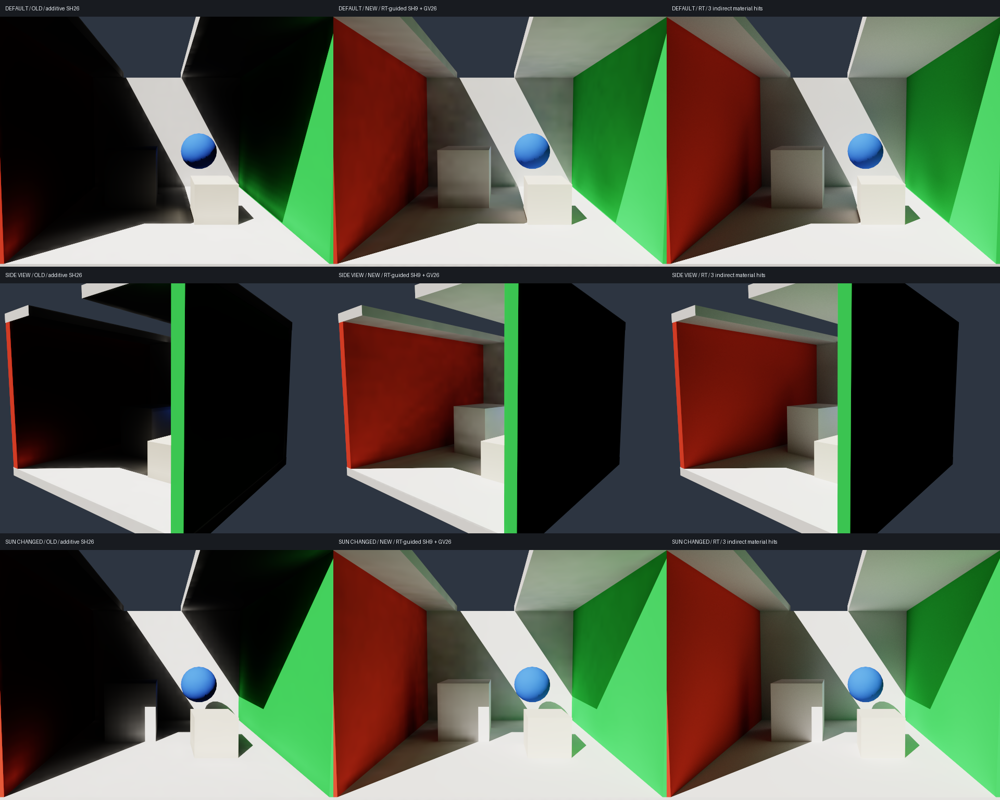

# 修正暗场：RT 引导的紧凑 SH9 光场

2026-10-05，Metal / SlangPy 0.43.0。默认 `sh` 已修正为 RT radiance 捕获 + 实际表面反射 + GV 约束的 26 邻域预测 + 时间 refinement。
同一完整 RGB 指标的误差由 **30.41% / 39.62% / 28.04%** 降到 **2.64% / 3.42% / 2.26%**，三组均通过原来的 5% 门槛。

上一轮把大误差归因于 SH9 表达能力不足，判断过早。准确光场压成 SH9 的诊断只有 2.57% / 3.32% / 2.25% 误差，
证明主要问题在原先的光场生成和传播。修正没有改变 reference、曝光、间接光强度或误差口径。



## 核对 UE5 的实际方案

本地引擎 `Engine/Build/Build.version` 是 UE5.8；在 Renderer、Engine/Shaders 和 Runtime plugins 中搜索，没有旧 LPV 实现。
Epic 的 [UE5 迁移指南](https://dev.epicgames.com/documentation/en-us/unreal-engine/unreal-engine-5-migration-guide)
明确说明 Lumen 替代了 LPV 和 DFGI。此前通过 Safari 读取的是 **UE4.27 的 LPV**，不能叫成 UE5 LPV。

本次只读核对了 UE5 源码：

- `Engine/Shaders/Private/Lumen/LumenScreenProbeTracing.usf`：射线获得照明，与 radiance cache 配合。
- `Engine/Shaders/Private/Lumen/LumenScreenProbeFiltering.usf` 的 `ScreenProbeConvertToIrradianceCS`：从方向 radiance 构建三 band SH，并进行漫反射卷积。
- `Engine/Shaders/Private/Lumen/LumenRadianceCacheInterpolation.ush`：带深度/视差信息的探针查询和空间插值。

新版本参考的是“捕获有效 radiance、压缩光场、按表面边界反射、空间/时间复用”的方向。
它是 **RT 引导的 SH 光场混合方案**，保留用户要求的 GV、26 邻域和历史；不是完整 Lumen，也不是 UE4 旧增量核的逐项复刻。
没有引入 Surface Cache、screen probes、screen traces、级联或 UE 的调度优化，也没有编译引擎。

## 为什么原先会收敛到暗场

旧核把整个光场反复注入到一个中心保留的增量算子，然后衰减历史：

```
C[t+1] = P³(0.9 C[t] + S)
visible = 0.1 C
```

因此其稳态是 `0.1 (I - 0.9 P³)^(-1) P³ S`，不是自动等于物理自由输运的解。
0.9 不仅过滤时间噪声，也进入空间传输的稳态算子。增大迭代次数只能更精确地求解这个算子，不能修正它的空间偏差。

在均匀 L0、无几何的低频近似下，旧 26 邻域核有：

```
a = 1 + (11/3) w
D = (13/12) w
P ≈ a I + D ∆
I - 0.9 P³ ≈ (1 - 0.9 a³) I - 0.9 * 3 a² D ∆
```

`w=.008` 时，“质量项”约 .01845，空间项约 .02479，对应 screening length 约 **1.16 个 cell**。
这只是 L0 低频分析，不是完整 SH 算子的精确距离界，但足以解释远处墙面为什么被压暗。
我们的细网格会把这种 cell 尺度的损失变成很短的世界空间传光距离。

此外，旧源是在表面格子里的 `Phi/h²` 代理，不等于每个探针处实际到达的 radiance；
opacity³ 加粗格平均 albedo 的反射也没有还原准确的表面反馈。
把 UE4 的经验预设套到本项目的 RT 面积注入、细网格和有限材质阶数，再据此评价 SH9，是不成立的比较。
这不是一个通过补单独的 pi 或统一放大亮度就能可靠修复的问题。

## 分离 SH 表达误差与输运误差

诊断先运行已有高精度方向求解器，然后仅将最终消费切到它导出的 SH9 场。
几何、光场、插值权重和相机保持相同；诊断不作为默认实现。

| 案例 | 方向图消费 | 同一光场的 SH9 消费 | 旧增量 SH26 |
| --- | ---: | ---: | ---: |
| 默认 | 2.54% | **2.57%** | 30.41% |
| 侧视角 | 3.30% | **3.32%** | 39.62% |
| 换太阳 | 2.15% | **2.25%** | 28.04% |

这说明在这些漫反射场景中，SH9 可以达到低误差；不能把旧结果的几十个百分点归给 SH 截断。
诊断确实分配了方向求解器的 3.72 GB，但新默认实现不依赖这个求解器，报告中分别记录内存。
报告见 [sh-projection-diagnostic.json](sh-projection-diagnostic.json)。

## 新光场生成与实际表面反射

每个探针使用 1024 个固定、等权、成对反向的球面 Fibonacci 方向。每条 ray 只查询最近一次命中：

- 首阶：在命中处计算 `Lo = Le + rho * E_direct / pi`。
- 后续阶：读取命中处上一材质阶的 SH irradiance，计算 `Lo[q] = rho * E[q-1] / pi`。
- 按 `Σ Lo(omega_i) Y_lm(omega_i) * 4pi/N` 投影为 RGB × 9 SH。

本项目 SH 存 light-travel direction，所以 ray 的查询方向与投影方向相反；漫反射消费查询 `-normal`。
读取上一阶时使用正常的 8 探针插值、距离矩/Chebyshev 可见性与法线偏移，和最终消费一致。
材质和法线来自**实际命中表面**，不再把平均颜色乘 opacity³ 当作主要反射机制。

仅在首阶加 emission 和太阳直接光；后续阶只读上一阶，避免重复加入光源或把求解历史误当成材料反射阶数。
每阶的源都是单次 ray hit 加缓存查询，不调用 `render.slang` 的多命中 RT reference，不读取 reference 数组，也不依赖相机。
固定射线投影仍有角度离散误差；1024 是这次三组验证的默认预算，不是任意场景的精度保证。

## GV 与 26 邻域的作用

保留 33³ 顶点 GV：L1 遮挡 SH、平均 albedo 和表面积。
新核使用其中的方向遮挡来控制跨格交换，实际材质反射用 RT 命中的 albedo。
面/棱/角连接仍分别平均 4/2/1 个 GV 顶点。

26 邻域现在是由 RT 捕获场约束的 radiance 预测器，不再不断加邻格能量：

```
anchor = captured[cell]
prediction = Σ Lebedev_weight[d] * project(
    (1-visibility) * evaluate(anchor, d)
    + visibility * evaluate(neighbor_previous_prediction, d), d)
next_prediction = (1-beta) * anchor + beta * prediction
```

`beta=.008`，默认做 3 次预测修正。26 个面/棱/角方向的 Lebedev 权重分别为
`4pi/21`、`4pi*4/105`、`4pi*9/280`；degree-7 quadrature 保持任意均匀 SH9 场的再投影。
空气中的预测使用 radiance 点查询，保持 signed SH，不重复 cosine convolution 或提前截断负重建值。
无效网格邻居回退到当地捕获场；被 GV 遮挡的贡献也回退到当地捕获场。

GV 在这版主要防止空间预测跨越边界。长距离到达的 radiance 由 ray 捕获保证，
26 邻域不是独自承担全部自由输运；不能把低误差宣称为旧 LPV stencil 的纯参数优化。
每一阶都先生成自身 RT anchor 并做预测，再供下一阶表面反射读取。

## 时间 refinement 独立于稳态能量

生成正确目标场 `T` 后，历史更新为：

```
C[t+1] = h C[t] + (1-h) T
visible = Σ C_order
```

默认 `h=.9`。不再额外乘 0.1，也不再每帧让历史经过那套有空间损失的增量算子。
固定场景下，使用历史与不使用历史得到相同稳态；历史只改变到达目标的过程。

当前目标场在光源/几何/射线预算/传播配置改变时重建；固定相机移动复用目标场，曝光只改变 tone mapping。
光源改变保留旧历史；网格、阶数、传播配置和显式重建清空历史。
每 32 次检查原始 SH 相对变化，稳定时暂停更新。批量图像先收敛光场，再累积规定的像素 spp。

默认冷启动检查在 **160 次更新**处确认稳定。理想 EMA 的剩余误差是 `0.9^t`：
32 次约 3.43%，64 次约 .118%，128 次约 .000139%，这里指距目标 SH 场的比例，不是 RT 图像 NRMSE。
逐显示帧更新仍可能有延迟；密集离屏 warmup 不等于用户等待 160 个显示帧。
当前固定方向捕获不随时间增加 ray 数，时间历史不消除固定 quadrature 的系统误差。

## 完整质量验收

640×480、32³、三阶间接材质反射；SH 图像 2048 spp、RT 16384 spp。
指标为 `sqrt(mean((LPV-RT)^2))/mean(RT)`，完整未曝光线性 RGB、含直接光，无 crop、无强度拟合。
RT reference 保持逐字节相同，报告记录 SHA256。原 RT 噪声估计为 .56% / .72% / .48%。

| 案例 | 旧增量 SH26 | 新 RT 引导 SH9 | 原方向扩展 |
| --- | ---: | ---: | ---: |
| 默认 | 30.41% | **2.64%** | 2.54% |
| 侧视角 | 39.62% | **3.42%** | 3.30% |
| 换太阳 | 28.04% | **2.26%** | 2.15% |

三组通过原有 5% 门槛；仅说明这三组固定场景通过，不是所有场景或每像素的误差界。
报告见 [sh-radiance-accuracy.json](sh-radiance-accuracy.json)。

默认视角消融（仍比较相同三阶 RT）：

| 配置 | NRMSE |
| --- | ---: |
| 完整新核 | 2.64054% |
| 关闭 GV 对空间预测的约束 | 2.63664% |
| 关闭历史，保留同一物理目标 | 2.64054% |
| 只保留首阶材质 | **13.25%** |

历史不再改变最终能量；实际表面反射确实恢复了旧核缺失的高阶贡献。
GV 的全图变化很小；当前主收益来自正确 radiance 捕获和表面反馈，不能归功于 GV 的全图误差改善。
消融与 temporal profile 见 [sh-radiance-ablation.json](sh-radiance-ablation.json)。

## 内存、性能与限制

默认 GI buffer payload **213.57 MB**；不包括场景、图像、CPU 数组和运行库。
其中距离矩和保留 depth scratch 约 152.35 MB，SH/history/目标/捕获约 51.38 MB，GV 和构建样本约 9.83 MB。
不分配逐方向 ray hit、材质、累计 radiance 或高密度 irradiance 图；射线流只在捕获 kernel 内临时使用。
GPU 的 scratch/cache、编译 runtime 和驱动开销不计入此 payload。

本机 CPU wall clock + `device.wait()`，640×480 / 1 spp，含 render/累积/tone map，不含窗口/UI/呈现：

| 操作 | 时间 |
| --- | ---: |
| 稳定消费 | **0.600 ms** |
| 已缓存目标场的一帧历史 refinement + 渲染 | **0.929 ms** |
| 光源改变，完整重建三阶 RT 目标 + 渲染 | **112.920 ms** |
| 第一帧（含冷准备） | 1.164 秒 |
| 第一帧后，密集完成历史 warmup | .0315 秒 |

上述为 2026-10-05 的完整重建计时。2026-10-06 已增加默认 4096 probes/frame 的分帧捕获，
新的同轮性能和响应测量见 [DYNAMIC_UPDATE.md](DYNAMIC_UPDATE.md)。0.929 ms 只含历史处理，不能当作完整动态 GI 更新成本。
只支持现有静态漫反射场景与太阳/自发光变化。性能报告见 [sh-radiance-benchmark.json](sh-radiance-benchmark.json)。

45 项 CPU/实际 Metal debug GPU 检查通过。新增均匀 SH9 的 26 邻域不变性、RT 表面反馈、黑材质吸收、
源/目标/相机缓存和时间递推检查。封闭自发光房间用精确 ray 可见性隔离 Chebyshev 近似，
验证显示辐亮度符合 `1+rho+rho²+rho³`；距离矩近似的最终效果另由三组完整图像验收覆盖。

## 复现

```bash
./run_local.sh
./run_local.sh --headless --frames 32 --spp 64 --output sample/output/sh-radiance.png
./run_local.sh --accuracy --extra-cases --reference-cache sample/output/accuracy-moments --output sample/output/accuracy-sh-radiance
./run_local.sh --evaluate-sh
./run_local.sh --benchmark-volume
./run_local.sh --test --debug
# 分离表达误差的高内存诊断：
./run_local.sh --accuracy --transport directional --projected-sh --extra-cases --reference-cache sample/output/accuracy-moments --output sample/output/accuracy-sh-projection
# 先前导致暗场的增量核 / 更早的六邻域核：
./run_local.sh --transport sh_ue4
./run_local.sh --transport sh_legacy
```

`sh_ue4` 名称只用于标识“参考 UE4 的旧增量核”，仍有本项目的注入/GV/材质阶数差异，不代表原版 UE4 的质量。
