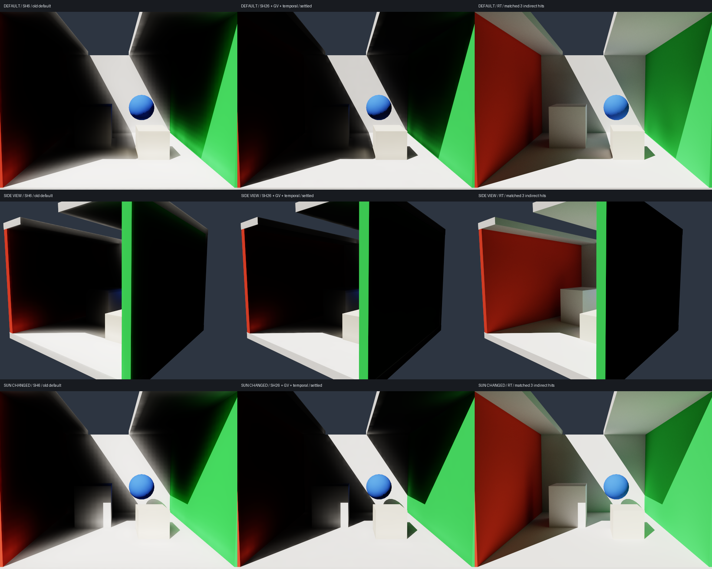
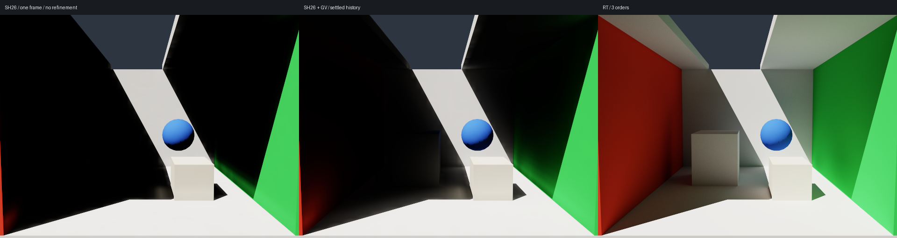

# SH9 LPV：geometry volume、26 邻域与时间 refinement

> 当前默认已修正为 RT 引导的紧凑 SH9 光场；本页保留此前核的历史记录，最新分析与低误差验收见 [SH_RADIANCE.md](SH_RADIANCE.md)。

2026-10-05，Metal / SlangPy 0.43.0。默认 `sh` 已改成 geometry volume + 26 邻域 + 持久光场历史。
原来的六邻域/五面重投影和短射线几何缓存保留为 `sh_legacy`；方向扩展保留为 `directional`。

这三项改动及方向 SH 重投影改善了固定案例，但仍不是高精度 GI：同一 32³ 预设下，完整线性 RGB 误差从
49.75% / 74.67% / 41.31% 降到 **30.41% / 39.62% / 28.04%**。不能据此断言 UE4 本身也有这些误差。

## 本次实际核对的 UE4.27 源码

通过用户登录的 Safari 阅读以下文件；没有下载整个引擎、复制引擎源文件或编译 Editor。
下列 GitHub 链接需要 Epic 仓库权限。

- [LPVPropagate.usf](https://github.com/EpicGames/UnrealEngine/blob/4.27/Engine/Shaders/Private/LPVPropagate.usf)：26 个邻格、距离平方倒数、中心保留、GV 遮挡和 opacity³ 次级反射。
- [LPVWriteCommon.ush](https://github.com/EpicGames/UnrealEngine/blob/4.27/Engine/Shaders/Private/LPVWriteCommon.ush)：点方向 SH 投影；传播输入的 solidAngle 为 1。
- [LPVCommon.ush](https://github.com/EpicGames/UnrealEngine/blob/4.27/Engine/Shaders/Private/LPVCommon.ush)：余弦卷积查询、0.9 上帧权重、0.1 最终照明系数。
- [LPVGeometryVolumeCommon.ush](https://github.com/EpicGames/UnrealEngine/blob/4.27/Engine/Shaders/Private/LPVGeometryVolumeCommon.ush)：L1 遮挡 SH 与 RGB 几何颜色。
- [LPVBuildGeometryVolume.usf](https://github.com/EpicGames/UnrealEngine/blob/4.27/Engine/Shaders/Private/LPVBuildGeometryVolume.usf)：RSM 几何样本及经验面积权重。
- [LPVInject_AccumulateVplLists.usf](https://github.com/EpicGames/UnrealEngine/blob/4.27/Engine/Shaders/Private/LPVInject_AccumulateVplLists.usf)：点方向注入，UE 使用负表面法线作为入射方向。
- [LightPropagationVolume.cpp](https://github.com/EpicGames/UnrealEngine/blob/4.27/Engine/Source/Runtime/Renderer/Private/LightPropagationVolume.cpp)：默认空间传播次数为 3。

## geometry volume

光场仍是 cell 中心的 RGB × 9 个 SH 系数；几何场位于 cell 顶点，所以 32³ 光场对应 33³ GV。
每个 GV cell 为两个 float4，32 字节：4 个 L1 方向遮挡系数，RGB 平均 albedo，以及面积。

面积样本按最近的 GV 顶点分桶。遮挡系数为 `Σ (A/h²) Y_lm(normal)`；材质为 `Σ A*rho / Σ A`。
几何场不读光照或相机，也不为传播链接发射射线。光源注入仍通过 RT 测试太阳可见性。
最终消费继续使用已有距离矩和 Chebyshev 权重；GV 负责传播中的遮挡，两者职责不同。

每条传播连接按中点对应的 GV 顶点平均：面邻居取 4 点，棱邻居 2 点，角邻居 1 点。
`opacity = saturate(cosine_lookup(GV, toward_neighbor) * secondary_occlusion)`。
传输乘 `1-opacity`；反射使用平均 albedo 与 `opacity³`。

本版使用真实表面积和纯 albedo；UE 的 GV 来自 RSM，并带投影面积及经验系数，颜色代理来自 VPL。
因此这是参考 UE 的结构和公式，不能称为 UE 输出的逐值复刻。

## 26 邻域传播和 SH 方向

本版存储 light-travel direction；UE 注入使用相反的入射方向。方向转换后保持查询/投影一致。
对于 receiver 指向 neighbor 的单位方向 `u`，距离平方 `d²`：

```
w = propagation_weight / d²
incoming = irradiance(neighbor_same_order, -u) * w * (1-opacity)
reflection = irradiance(center_previous_order, u) * w * albedo * opacity³ * secondary_bounce
next_same_order = center_same_order + Σ project_direction(incoming + reflection, -u)
```

默认 `propagation_weight=.008`，每次传播后 `decay=1`。
点方向投影使用 `Y_lm(u)`，而不是每走一格再乘一次余弦卷积的 band 因子。
查询仍做 SH 余弦卷积，并截断负 RGB。旧核的出射通量预算仅保留在 `sh_legacy`，没有掺入这套 UE 风格核。

源通量为 `(rho * E_direct + pi * Le) * A`，新核将 `Phi/h²` 做点方向投影，方向为表面法线。
这与旧核 `Phi/(pi*h²)` 的余弦瓣投影保持相同的方向积分，但高阶系数不同。

为了继续与三次间接命中的 RT reference 比较，每个材质阶数仍单独存储。
空气传播保持阶数，反射只读取上一材质阶数。没有把传播迭代计数误当成反射深度。
UE 在同一光场内混合反射贡献；这里的有限阶分离是另一项明确差异。边界之外使用零光场，UE 邻格坐标采用 clamp。

## 持久时间 refinement

每次更新先衰减上一帧原始 SH，再注入当前源，做 3 次空间传播，最后缩放并合并各材质阶：

```
raw[t+1] = P³(0.9 * raw[t] + source[t])
visible[t+1] = 0.1 * Σ raw_order[t+1]
```

0.1 是配套的历史归一化，不是对 RT 拟合亮度。光源改变时保留历史，逐帧收敛；R 重建、网格/材质深度/
传播配置改变时清空历史。相机和曝光不改变光场。源样本当前是固定的，这里 refinement 求解的是光场，
并没有通过重新随机采样累积更高精度的表面注入。

这不是固定场的普通图像 EMA。光场变化时会重置像素累积，避免旧 GI 混进新图；光场稳定后正常累积像素 spp。
每 32 次更新检查原始 SH 的最大系数变化；相对变化低于 1e-5 或绝对变化低于 1e-7 时暂停静态更新。
光源变化后自动恢复。检查包含 GPU 等待和 CPU readback，不是纯 GPU 计时。
批量渲染、`--accuracy` 和 `--compare` 会先 `settle_volume()`，之后才累积规定的像素 spp。

默认场景首次需要 **416 次更新**；換光源需要 **352 次**。这分别表示从空场初始化和保留旧光场后的求解，
不能把后者当作冷启动收敛速度。若严格每显示帧只做一次更新，416 帧在 60 Hz 下约 6.9 秒，存在明显响应滞后。

均匀无几何场中，26 个 `1/d²` 权重的和是 44/3，L0 点投影到余弦查询的乘积是 1/4。
因此均匀场的单次增益是 `g = decay * (1 + (11/3)*weight)`，时间递推至少要满足 `history_weight * g^steps < 1`。
默认约为 0.982。保留相同权重时 4 次就超过 1，旧默认的 40 次不能直接沿用。
参数校验会拒绝这类均匀场已经不稳定的组合；这个检查不是任意几何和 SH 截断场的完整稳定性证明。

`--no-refinement` 用于单帧消融，历史置零、最后缩放置 1、传播权重改为 .08，与 UE 非 refinement 预设对应。

## 同一口径的质量评估

640×480，LPV 2048 spp / RT 16384 spp，32³，3 阶材质反射，moments 消费。
指标为 `sqrt(mean((LPV-RT)^2))/mean(RT)`，完整未曝光线性 RGB，不裁剪、不拟合增益。
沿用原有 reference 数组，副本逐字节相同，报告记录 SHA256；RT 噪声估计为 0.56% / 0.72% / 0.48%。

| 案例 | 旧六邻域 SH | 新 SH26 + GV + refinement | 既有方向扩展 |
| --- | ---: | ---: | ---: |
| 默认 | 49.75% | **30.41%** | 2.54% |
| 侧视角 | 74.67% | **39.62%** | 3.30% |
| 换太阳方向 | 41.31% | **28.04%** | 2.15% |



新核仍未通过 5% 门槛；屋顶、背光墙和盒体附近仍能看到大面积缺少间接光。
旧核数字来自同一 32³ 默认预设；不是 `validate_accuracy.py` 图中另列的 16³ legacy 参数基线。
后者默认视角约 29.82%，也说明提高密度或改变传播核并不保证在所有配置上更准确。
完整报告见 [sh-refinement-accuracy.json](sh-refinement-accuracy.json)。

默认视角的消融（其余使用相同 reference 和 2048 spp）：

| 配置 | 完整 RGB 误差 |
| --- | ---: |
| 完整新核 | 30.41% |
| 关闭 GV 遮挡及其反射 | 29.62% |
| 关闭时间 refinement，单帧 3 次传播 | 34.64% |
| 只保留首阶材质，仍比较三阶 RT | 30.45% |

这不能证明 GV 没有价值：全图指标含大量相同的直接光，会掩盖局部漏光；不过也不能把这次改善全归功于 GV。
当前 opacity³ 反射对这个案例的全图收益很小。高阶材质机制已经存在，但未还原 RT 的间接能量分布。
消融记录与各更新阶段距最终 SH 场的变化见 [sh-refinement-ablation.json](sh-refinement-ablation.json)。



> 下述判断仅适用于当时的增量输运核。下一轮 SH9 表达诊断和 RT 引导修正已证明同样九系数可以达到低误差，见 [SH_RADIANCE.md](SH_RADIANCE.md)。

当时的结论是：这套增量核不适合把结果当作 ground truth 的收敛替代。
时间 refinement 消除迭代未收敛的误差；它不能恢复已经被低阶 SH、GV 和局部传播算子丢失的信息。
本版没有测量真实 UE4 渲染误差。

## 内存和性能

32³，三阶材质；实际分配的 GI buffer payload，不包括图像、场景、CPU 数组和运行库。

| 数据 | 十进制 MB |
| --- | ---: |
| source + 最终 SH | 7.34 |
| 三阶历史双缓冲 | 22.02 |
| 注入样本与范围 | 8.65 |
| 33³ GV | 1.15 |
| GV 构建样本与范围 | 8.68 |
| 距离矩、保留 depth scratch 及索引 | 152.34 |
| 合计 | **200.19** |

目前保留 GV 构建样本，方便几何缓存重建；没有做半精度 packing 或释放 scratch 的微优化。

本机同步 CPU wall clock（含 render/累积/tone mapping，不含窗口/UI/呈现）：

| 配置 | 稳定消费 | 一次更新加渲染 |
| --- | ---: | ---: |
| 新 SH，单次 3-pass refinement | 0.629 ms | **2.377 ms** |
| 方向扩展，完整 40/41-step 更新 | 0.596 ms | 1420.683 ms |

两种更新的工作量和达到稳定场的方式不同，不能把这两个数字直接解释成等质量的速度倍率。
新 SH 第一帧约 0.804 秒（含冷准备），随后密集完成余下 refinement 约 0.750 秒。
性能报告见 [sh-refinement-benchmark.json](sh-refinement-benchmark.json)。

## 复现

```bash
./run_local.sh
./run_local.sh --transport sh_ue4 --headless --frames 32 --spp 64 --output sample/output/sh26.png
./run_local.sh --accuracy --transport sh_ue4 --extra-cases --reference-cache sample/output/accuracy-moments --output sample/output/accuracy-sh-refinement
./run_local.sh --evaluate-sh
./run_local.sh --benchmark-volume
./run_local.sh --test --debug
# 原有六邻域核：
./run_local.sh --transport sh_legacy
```

`--accuracy` 超过 5% 时仍返回 1，这次是质量未达标，不是 Slang 编译或 GPU 执行错误。
