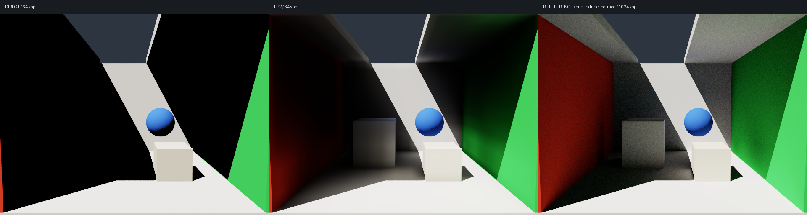
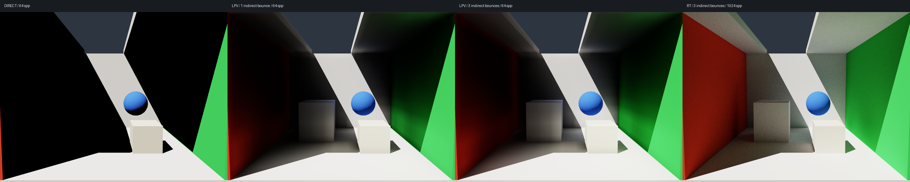

# 校对与优化验证

2026-10-03，本机 Python 3.13.12、SlangPy 0.43.0 本地构建、Metal。
复用 DSHARC 的环境，没有编译 Unreal Editor 或新增依赖。

```bash
./run_local.sh --test --backend metal --debug
./run_local.sh --test-download
./run_local.sh --compare
./run_local.sh --benchmark
./run_local.sh --window-frames 3 --width 960 --height 640
```

12 项 CPU/GPU 检查与 7 项离线下载器检查全部通过。窗口启动并呈现三帧成功。
Metal 现有运行库会打印 `No supported shader model found, pretending to support sm_6_0`；
ray query、SH 注入和传播检查实际执行成功，没有跳过 GPU 验证。

## 三轮改进

| 轮次 | 改动 | 验证 |
| --- | --- | --- |
| 第一轮 | 4 → 9 个 RGB SH 系数，补充 band-2 注入、方向查询和 diffuse 卷积 | Lambert 通量保持；SH 方向与卷积解析检查通过；同一 320×240 测试 RMSE 27.59% |
| 第二轮 | 单条格子中心射线 → 每方向五射线部分遮挡 | 全遮挡、部分遮挡、双向一致性检查；同尺寸 RMSE 26.65% |
| 第三轮 | 分开表面采样、分桶、遮挡、注入源与传播缓存；参考/直接光跳过 LPV | 参数变化失效检查；源场复用保持逐值一致；同步更新耗时下降 |

没有直接照搬 UE4 的 26 邻域、时间 refinement 与经验强度常数。
这里保持原有六邻域/五面传播、面积权重与 `Phi/pi` 的量纲；九系数 SH 也沿用原有的光传播方向约定。
两套实现的 SH 正负号不同，因此逐项核对基函数和卷积，不能直接粘贴 UE4 查询表达式。

## 前一阶段：单次反射图像与误差



相同 640×480 相机，16³ / 24 步 / 131072 表面样本 / decay=0.95；
直接光与 LPV 为 64 spp，RT 参考为一次间接材质反射、1024 spp，无 denoiser。

| 未曝光线性 RGB 指标 | 第一版 | 当前 |
| --- | ---: | ---: |
| LPV 总光照平均 RGB | 0.120963 | 0.117587 |
| RT 参考平均 RGB | 0.121958 | 0.121958 |
| 直接光近零区域的 LPV 平均间接 RGB | 0.009395 | 0.008431 |
| 同区域 RT 平均间接 RGB | 0.024843 | 0.024843 |
| 归一化 RGB RMSE | 29.95% | 26.65% |

误差定义为 `sqrt(mean((LPV-reference)²))/mean(reference)`。当前误差相对降低约 11%，
但并非每个区域都改善：远处阴影仍偏暗，细节与光照范围仍受粗网格限制。
不能用平均亮度接近证明质量，或把该结果解释为路径追踪级精度。

另做九组 injection bias / read bias / decay 扫描。
提高 decay 至 0.98 或 1 会增大该场景的总体误差；降低读取 bias 虽改善一个相机的 RMSE，
也使阴影光照更暗。没有据此硬调默认值或统一放大间接光。

## 缓存更新耗时

`--benchmark` 在相同 SH9 和遮挡算法上模拟旧失效策略，对照新缓存。
16³ / 131072 样本，24×24 / 1 spp，排除编译、场景创建和预热；九次变动的中位数。
使用 CPU 计时并在每帧后 `device.wait()`，包括 CPU 与 GPU 完成时间，不是独立 GPU kernel 时间。

| 变动 | 旧失效策略模拟 | 拆分缓存 |
| --- | ---: | ---: |
| 注入 bias | 26.13 ms | 15.91 ms |
| 传播步数 | 2.58 ms | 1.40 ms |
| 太阳强度 | 2.48 ms | 2.44 ms |

主要收益是省掉不必要的采样、遮挡和 shadow ray；不是 LDS、packing 或线程组微优化。
上述时间是本机一次测量，不代表其他后端的帧率。

## 检查覆盖

- 表面样本面积、确定性、分桶权重与出界丢弃，不重新归一化。
- Lambert 直接光 `rho*E/pi` 与注入积分通量 `rho*E*area`。
- 样本数量翻倍不改变总注入通量；黑顶盖下直接光与注入为零。
- 五射线遮挡全阻断、部分阻断、反向一致性。
- 各向同性单格源在 decay=1 的单步传播中积分能量守恒，只进入六邻居。
- 均匀 SH 场的 diffuse 解析解，以及九系数余弦瓣的方向符号、旋转后的加法定理解析解和卷积。
- 正的阴影 GI、关灯清空、确定性 reset、图像/线性数组导出。
- 直接光与 RT 参考不构建 LPV；相机/读取变化不重建光场；步数复用注入源；bias 保留采样/遮挡。
- 下载器真实 Range、忽略 Range、断线、前缀不一致、授权过期、完整 partial 恢复与安全的 LPV 选择性解压（离线模拟）。

这些检查没有证明所有方向场在任意步数下严格能量守恒。
低阶 SH 截断负重建值仍有偏差，默认保留传播衰减；该阶段尚未加入材质多次反射；下一节记录补充后的验证。级联和完整 geometry volume 仍未实现。

## UE4 源码与下载状态

通过现有 Safari 登录实际阅读了 4.27 的五个文件：
`LPVCommon.ush`、`LPVWriteCommon.ush`、`LPVPropagate.usf`、
`LPVInject_GenerateVplLists.usf`、`LPVFinalPass.ush`。
核对了 9 个 RGB SH 系数、方向重投影、diffuse 卷积、注入法线偏移、26 邻域和时间 refinement。

完整 ZIP 下载尚未成功：无登录的 CLI 返回 404；浏览器取得的临时 codeload 地址可访问，
但 HTTP/2 与 HTTP/1.1 均遭遇断线，临时授权过期后返回 404。
Range 实测返回 200 而非 206。当时 Safari 窗口读取失败，未能继续刷新下载授权；2026-10-04 已能再次通过 Safari 阅读源码。
已经保留部分下载，并补充不会截断进度的下载器；不能把部分 ZIP 当作已取得的本地引擎参考。

原来的浅 partial clone / sparse checkout 脚本也仍保留，CLI 没有可用 Epic 仓库 Git 凭据。
私有引擎源码不会加入项目提交。

## 2026-10-04：补充材质多次反射

16 项 CPU/GPU 检查全部通过（Metal debug layers），窗口启动并呈现三帧成功。
新增解析检查：黑色材质不反射；可见比例 0.6、遮挡比例 0.4 时，透射通量为 `0.6*S`，
反射通量为 `0.4*rho*S`；封闭各向同性测试得到 `S*(1+rho+rho²)`，后续步骤不重复计入。
实际 ray query 缓存的反射率、覆盖比例、反射法线半球与独立 CPU SH 公式一致。
反射深度变动保留源场、样本、分桶与几何缓存；回到深度 1 后旧画面逐值一致。



仍用 640×480、16³ / 24 空间步、decay=0.95，LPV 64 spp、RT 1024 spp。
RT reference 改为三次间接材质反射；两个 LPV 版本都对照这一张参考，不能与上节的单次 RT 误差直接比较。

| 线性 RGB 指标 | LPV 一次 | LPV 三次 | RT 三次 |
| --- | ---: | ---: | ---: |
| 平均 RGB | 0.117587 | 0.125087 | 0.134915 |
| 直接光近零区域的平均间接 RGB | 0.008431 | 0.012442 | 0.037072 |
| 对照 RT 三次的归一化 RMSE | 29.13% | 30.12% | — |

反射补回了部分阴影能量，但全图 RMSE 略升。粗网格、空间重投影、SH 截断、有限空间步和每步衰减
仍导致偏差；增加材质反射会继续传递原有空间误差。这一结果不支持“反射次数更多便自动逼近 ground truth”。
保持反射率归一化，没有根据这个相机拟合额外强度。`--bounces 1` 保留可复现的旧算法对照。
详细源码核对和离散算子见 [SECONDARY_BOUNCES.md](SECONDARY_BOUNCES.md)。

## 2026-10-04：5% 验收与方向传播

最新默认配置为 32³ / 1154 方向 / 每阶 40 空间步 / 三个材质阶数 / decay=1 / read bias=0。
完整 640×480 线性 RGB、LPV 2048 spp / RT 16384 spp：默认视角 2.76%，侧视角 3.86%，换太阳方向 2.35%，全部低于 5%。
同一高采样 RT 下的原 SH 默认配置为 30.03%。
21 项 CPU/GPU 回归检查通过；新默认窗口呈现三帧成功。
公式、定位实验、采样噪声与资源代价见 [ACCURACY.md](ACCURACY.md)，原始机器报告见 [accuracy-report.json](accuracy-report.json)。
此阶段改变了角度表示和空气中的传播算子，旧 SH 算法仍可通过 `--transport sh` 运行。


## 墙面低频暗斑修复

默认首段改为探针 RT 的八个角度范围子样本平均，后续保留方向传播及材质反射。
24 项 CPU/GPU 检查（Metal debug）与窗口三帧呈现通过。
完整三案例 NRMSE 为 1.79% / 2.30% / 1.73%，reference 数组与之前逐值一致。
固定红墙/后墙/天花板区域的低频误差残差标准差分别减少 75.3% / 67.8% / 63.1%。
测量口径、缓存代价及前后图见 [WALL_ARTIFACTS.md](WALL_ARTIFACTS.md)。


## 2026-10-05：DDGI 距离矩防漏光

默认探针消费与次级反射查询采用八面体距离矩 + Chebyshev 权重，另缓存 irradiance 法线方向图。
29 项 CPU/GPU 检查通过，包含概率解析、矩/方差、接缝、轴向 irradiance、平面无自照明、1 mm 薄墙、缓存与既有反射检查。
窗口三帧呈现通过。完整三案例 NRMSE 为 2.54% / 3.30% / 2.15%。
以少量近似误差换取性能：640×480 / 1 spp 稳定离屏帧 9.06 ms → 0.62 ms；次级更新 2.37 s → 1.46 s。
原始性能报告、全部质量比较及限制见 [PROBE_VISIBILITY.md](PROBE_VISIBILITY.md)。


## 2026-10-05：紧凑 SH 默认版

默认改为 SH9 + RT 表面注入 + 材质反射 + 距离矩过滤。34 项 CPU/Metal debug GPU 检查与窗口三帧启动通过。
32³ GI buffer payload 为 212.51 MB；稳定离屏帧 0.613 ms，传播更新 13.86 ms。
完整三案例 NRMSE 为 49.75% / 74.67% / 41.31%，未通过 5% 门槛。
旧方向扩展可用 `--transport directional`，其删除冗余缓存后的三案例 RGB 与上版逐值一致，依然通过 5% 门槛。
完整内存、性能和画质取舍见 [COMPACT_LPV.md](COMPACT_LPV.md)。

## 2026-10-05：GV / SH26 / 时间 refinement

- `./run_local.sh --test --debug`：41 项 CPU 与实际 Metal GPU 检查通过。
- 新检查覆盖 26 邻格支持、中心保留与 SH 方向，真实表面积/平均 albedo，面/棱/角 GV 的 4/2/1 点查询，
  opacity³ 材质反射与阶数隔离，0.9 历史递推、重建清空、光源变化保留历史、静态收敛及相机独立性。
- 原有 SH/方向扩展、Chebyshev 薄墙查询、缓存失效及资源切换检查继续通过。
- `./run_local.sh --window-frames 3 --width 320 --height 240 --grid 16 --source-samples 4096 --debug`：窗口/UI 三帧通过。
- 完整 640×480 / 2048 spp 对照保持原 16384 spp RT reference 逐字节一致。
  新 SH 的 30.41% / 39.62% / 28.04% 未通过 5% 质量门槛；验收程序返回 1，区别于 GPU 测试失败。
- 同步性能、消融和可视化见 [SH_REFINEMENT.md](SH_REFINEMENT.md)。没有编译 Unreal。

## 2026-10-05：RT 引导 SH 光场修正

- 同一准确方向光场仅改为 SH9 消费：2.57% / 3.32% / 2.25%。上一轮把大误差归因于 SH9 的结论被该诊断修正。
- 新默认直接构建紧凑 SH 场，RT 命中表面读取上一材质阶数的 irradiance，保留 GV/26 邻域预测；历史更新不改变稳态能量。
- 完整 640×480、2048 spp / 原 16384 spp reference：**2.64% / 3.42% / 2.26%**，三组通过 5% 门槛。
  RT reference 数组未改动；报告保存 reference SHA256，重渲染默认视角与消融完整核逐值一致。
- `./run_local.sh --test --debug`：45 项检查通过；capture 阶数分支改成显式 if 后，四项新增 Metal debug GPU 检查再次通过。
- 均匀 SH9 的 26 邻域保持不变；封闭自发光房间使用精确 ray 可见性验证 `1+rho+rho²+rho³`；黑材质后续阶数为零。
- `./run_local.sh --window-frames 3 --width 320 --height 240 --grid 16 --source-samples 4096 --probe-rays 128 --debug`：窗口/UI 三帧通过。
- GI buffer payload 213.57 MB；稳定消费 .600 ms；仅历史更新 .929 ms；完整 RT 目标重建 112.920 ms。
  完整重建尚未分帧，不能将 .929 ms 当作动态 GI 总成本。详见 [SH_RADIANCE.md](SH_RADIANCE.md)。
- 本地 UE5.8 shader 源码只读核对，没有编译 Editor。默认混合方案与完整 Lumen/原版 UE4 LPV 保持明确区别。


## 2026-10-06：有预算的动态捕获

默认 4096 probes/frame，48 项 CPU/Metal debug GPU 检查全部通过。新增非整除分批/偶数预测 pass 的目标一致性、未完成捕获的收敛保护、连续光照变化的任务推进，以及中途结构变化的重启检查。

完整 640×480 / 2048 spp、同一 RT 16384 spp reference，三组 NRMSE 为 2.64054% / 3.41705% / 2.25872%。目标场与完整捕获逐值相同；不同历史收敛停止时刻只造成微小浮点图像差。

同轮预热：整场重建 5 次中位数 111.17 ms；默认捕获帧中位数 10.89 ms、最大 11.94 ms；完整目标捕获 24 帧，亮度阶跃约 32 帧达到 90% SH 光场变化。没有减少总射线数，也不保证动态过程每帧低于 5% 画面误差。

报告与复现见 [DYNAMIC_UPDATE.md](DYNAMIC_UPDATE.md)、[sh-dynamic-benchmark.json](sh-dynamic-benchmark.json)、[sh-budgeted-accuracy.json](sh-budgeted-accuracy.json)。
