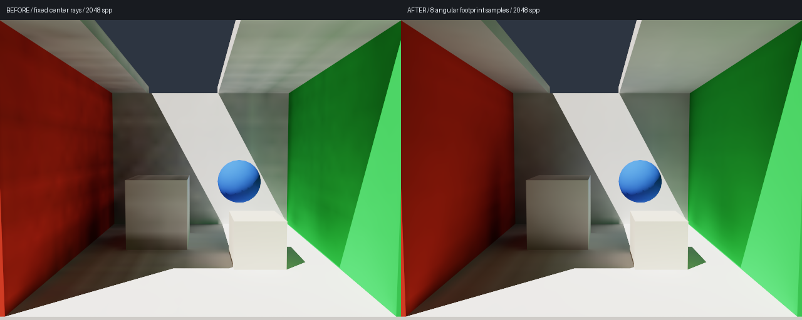

# Low-frequency dark patches on walls: diagnosis and fix

> The current default has been corrected to an RT-guided compact SH9 field. This page preserves the earlier kernel's history; see [SH_RADIANCE.md](SH_RADIANCE.md) for the latest analysis and low-error acceptance results.

> The default was subsequently upgraded to GV + 26 neighbors + temporal refinement. This page records the preceding kernel / preset; see [SH_REFINEMENT.md](SH_REFINEMENT.md) for that evaluation.

> 2026-10-05 update: the passing results and directional-map consumption described here apply to `--transport directional`. The default at that stage became compact SH LPV; see [COMPACT_LPV.md](COMPACT_LPV.md) for its memory, performance, and substantial quality regression. The accumulated angular cache in directional mode is now allocated on demand.

## Symptoms and causes

Although the previous default field passed the full-image 5% NRMSE gate, stable dark bands remained on walls and the ceiling.
Each direction in the fixed angular set used only its center ray. At openings, lit regions, or geometry edges, its contribution switched between a bright value and zero.
Grid interpolation turned these discontinuous angular-coverage changes into broad brightness variations. More final-image spp only converges pixel sampling; it cannot remove this stable field aliasing.

In discrete-direction transport, this is called ray effects. Related research treats first-flight free transport separately to reduce angular-discretization artifacts.
See [Christensen et al., JCP 2024](https://doi.org/10.1016/j.jcp.2024.113049).
This fix borrows only the decomposition idea. It does not reproduce that paper's conservative surface-current method or establish strict flux conservation.

The diagnostic evidence here is that changing only first-flight angular coverage substantially reduces the patches, with the grid, direction count, reflection depth, interpolation, read bias, and indirect strength held fixed.
Changing read bias alone did not achieve the same effect. Finite grid / direction errors may remain; this does not rule out every other cause of dark patches.

## Fix

At each probe, compute first-order radiance from directly lit surfaces, replacing a direction bin's center value with its average over the spherical angular footprint:

\[
\bar L_{0,i}(x)\approx \frac1S\sum_{k=1}^{S}
\left[L_e(y_k)+\frac{\rho(y_k)}\pi E_{\rm direct}(y_k)\right],
\qquad y_k=\operatorname{firstHit}(x,-\omega_{i,k}).
\]

Misses contribute zero. Directional subsamples come from deterministic Fibonacci points inside the actual spherical Voronoi bin, stratified along z; opposite bins use mirrored samples.
The default is S=8; S=1 uses the direction center for ablation. Subsample generation reads neither scene lighting nor reference images.
Every subsample independently reads hit-surface albedo, emission, normal, and sun visibility.

Full RT rays solve the first flight, and the result directly becomes the solved first material order. **It is not propagated or accumulated again through the grid.**
The subsequent two material orders still use existing surface reflections and direction-preserving grid propagation.
This is hybrid first-flight handling for the directional-volume method, not an unchanged traditional SH LPV implementation or per-pixel path tracing.
Final consumption remains visibility-filtered eight-neighbor linear interpolation with angular cosine integration, and read bias remains 0.
The camera-shading shader was not changed, and no smoothing filter was applied to the output image.

Sources are `angular_footprints/update` in `sample/directional_volume.py` and `direct_main/copy_direct_main` in `sample/shaders/directional.slang`.
The first-order cache depends on the scene/grid/direction lattice, lighting, subsample count, and decay. Camera, read bias, reflection depth, and spatial steps do not rebuild it.
Non-default decay is applied using ray distance / cell size, consistent with distance attenuation in later directional propagation.
`--steps 0` still returns the RT-completed first order; later orders are zero.

The cost is more RT queries during initialization or lighting changes: about 303 million first-flight rays by default, plus sun-shadow queries after hits.
The angular-subsample table is about 148 KB. The main angular cache remains about 3.8 GB; no complete extra directional field was added.
Camera movement reuses first-order and geometry caches. The deterministic sampling does not require temporal accumulation and introduces no motion-history ghosting.

## Measurements and observations

640×480, LPV 2048 spp, independent RT 16384 spp, 32³ / 1154 directions / three indirect material orders.
The same reference image is used; reference arrays are bit-identical before and after. Exposure was not changed and intensity was not fitted.

| Case | Full-image NRMSE before | Full-image NRMSE after |
| --- | ---: | ---: |
| Default view | 2.76% | 1.79% |
| Side view | 3.86% | 2.30% |
| Changed sun direction | 2.35% | 1.73% |



To measure wall variation rather than only a full-image average, three fixed planar regions away from geometry edges are selected in the default view.
Brightness is mean RGB, and the error is LPV minus RT. Only when **measuring error**, apply a fixed 9×9 box average,
then compute the spatial standard deviation and divide by the region's mean reference brightness. This suppresses reference Monte Carlo noise without modifying rendered images.
The reference retains the actual GI gradient; the metric measures spatial variation away from that gradient.
These regional metrics are diagnostic and do not replace full-RGB acceptance.

| Region | Residual standard deviation before | Residual standard deviation after | Reduction |
| --- | ---: | ---: | ---: |
| Red wall | 4.62% | 1.14% | 75.3% |
| Back wall | 5.73% | 1.85% | 67.8% |
| Ceiling | 3.05% | 1.12% | 63.1% |

See [wall-artifacts-report.json](wall-artifacts-report.json) for complete coordinates and unfiltered regional RMSE / mean bias.
The measurement script is `scripts/measure_wall_artifacts.py`. Original linear arrays remain locally in `sample/output/accuracy-final` (before) and `accuracy-footprints` (after).

Varying only the first-flight subsample count in the current implementation at 512 spp, against the same 16384 spp RT reference, gives 2.77% for S=1, 1.86% for S=4, and 1.83% for S=8.
Both variants in this ablation use full first-flight RT, so S=1 is not bit-identical to the historical grid-based first-flight version.
Ablation report: [wall-footprint-ablation.json](wall-footprint-ablation.json).
Eight samples further reduce residual variation and are therefore the default; 32 samples were not added as a required optimization.

```bash
./run_local.sh
# Compare direction-center sampling with angular-footprint averaging:
./run_local.sh --source-angular-samples 1
./run_local.sh --source-angular-samples 8
./run_local.sh --accuracy --extra-cases
./run_local.sh --test --backend metal --debug
```

24 CPU/GPU checks pass. New checks verify that subdirections lie within their bins, are normalized, and have antipodal symmetry;
first-order planar reflected radiance remains correct; bins crossing black/emissive edges average partial coverage; and sample-count / decay changes update only the source cache. Existing checks for black absorption, lights off, directional preservation in air, and material-reflection series still pass.
The three-frame window presentation check passes. Coarse-grid error, secondary-reflection angular aliasing, and finite angular-integration error are not completely eliminated by this fix.
